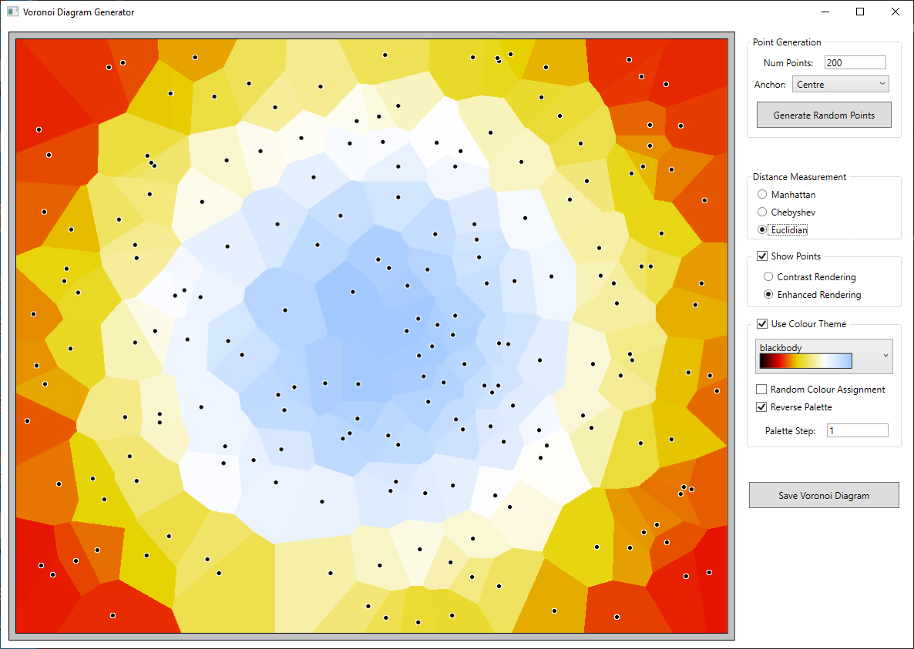

# Voronoi Diagram Generator implemented in C# #

This repository contains the code for a Voronoi Diagram Generator WPF application implemented in C#.  
 

### Prerequisites

- [.NET 6 SDK](https://dotnet.microsoft.com/en-us/download/dotnet/6.0)

 

### What does it do?

Generates Voronoi Diagram (tessellation) images.  
Given a set of points (which the application randomly scatters across the image canvas) then, for each point, the corresponding Voronoi cell consists of all locations closer to it than any other point.  
Although this WPF application generates Voronoi diagrams purely as works of art, such diagrams actually have several practical applications (see https://en.wikipedia.org/wiki/Voronoi_diagram)  
 

### How to use the application
When the Voronoi Diagram Generator WPF application is run, the UI appears as follows:    

 

Various settings can be changed in order to modify the Voronoi Diagram image that is generated; these have been divided into the following groups:  
* Point Generation.  
  * `Num Points` edit control that allows you to specify the number of points to be generated (between 1 and 500); these will then be randomly spread across the image canvas.
  * `Anchor` drop-down list control that allows you to specify where the position within the canvas that the origin of points should be anchored to; the available options are:
    * None (Random) - No anchoring will be applied (generated points will be distributed entirely randomly across the image canvas)
    * Centre - The origin of the points is at the centre of the canvas (so points are generated starting at the centre and spreading out towards the edges of the canvas; therefore when themed colouring is applied, the colours spread out from the centre of the image)  
    * Top-Left - The origin of the points is at the top-left corner of the canvas (so points are generated starting at the top-left corner and spreading out towards the bottom-right corner of the canvas)  
    * Top-Right - The origin of the points is at the top-right corner of the canvas (so points are generated starting at the top-right corner and spreading out towards the bottom-left corner of the canvas)  
    * Bottom-Left - The origin of the points is at the bottom-left corner of the canvas (so points are generated starting at the bottom-left corner and spreading out towards the top-right corner of the canvas)  
    * Bottom-Right - The origin of the points is at the botom-right corner of the canvas (so points are generated starting at the bottom-right corner and spreading out towards the top-left corner of the canvas)  
  * `Generate Random Points` button that, when clicked, triggers the generation of randomly distributed points and the calculation of their corresponding Voronoi cells. Note that the `Num Points` and `Anchor` settings are only applied to the new diagram that is generated when this button is clicked and do not affect the currently displayed Voronoi Diagram image.  
  
   
* Distance Measurement  
  * `Manhattan` radio button control that allows you to select Manhattan Distance (`|x2 - x1| + |y2 - y1|`) as the method of calculating the distance between points.
  * `Chebyshev` radio button control that allows you to select Chebyshev Distance (`max(|x2 - x1| , |y2 - y1|)`) as the method of calculating the distance between points.
  * `Euclidian` radio button control that allows you to select Euclidian Distance (`sqrt((x2 - x1)² + (y2 - y1)²)`) as the method of calculating the distance between points.
  
   
* Show Points - Has a checkbox control that indicates if the points should be rendered within the diagram. When the `Show Points` option is checked then the following options become available: 
  * `Contrast Rendering` radio button control that allows you to select that points be rendered using a contrasting colour (i.e. as a black dot when the Voronoi cell is light coloured, and a white dot when the cell is dark coloured).
  * `Enhanced Rendering` radio button control that allows you to select that points be shown using an enhanced rendering scheme whereby a black dot is drawn surrounded by a white circle (to ensure that the point is clearly visible on both light and dark coloured Voronoi cells)
  
   
*  Use Colour Theme - Has a checkbox control that indicates if a colour theme should be used when colouring the cells in the Voronoi Diagram image. When `Use Colour Theme` is unchecked then the cells in the image are randomly coloured; when checked, a colour theme is used and the following options become available:  
    * Theme selection drop-down list control that allows the selection of a theme from a preset list of colour themes.
    * `Random Colour Assignment` checkbox control that allows you to specify that the colours from the selected theme should be randomly assigned to the Voronoi cells. When unchecked, theme colours are assigned to the cells in a sequential manner; this, when used in combination with a non-random Anchor setting, can produce some nice diagram images.
    * `Reverse Palette` checkbox control that, when checked, causes the colours in the selected theme to be used in reverse order, which can sometimes improve the generated diagram image.
    * `Palette Step` edit control that allows the step value (that is applied when sequentially assigning colours from the selected theme to Voronoi cells) to be changed (to a value between 1 and 10). So, for example, when the Palette Step value is set to 3, only every third colour in the theme's palette is used when assigning colours to the Voronoi cells; this makes the application cycle through the palette quicker and can give improved diagram images (particularly when using a small number of points)

 

Points can be manually added to the current Voronoi Diagram by clicking within the image with the left mouse button at the position at which the point is to be placed; the application will then calculate the Voronoi cell for this new point and update the image accordingly. Points can also be removed from the current diagram by clicking on a point using the right mouse button.

 

The current Voronoi Diagram image can be saved to a file by clicking the `Save Voronoi Diagram` button. The `Save As` dialog box that is then displayed allows one of five file types (i.e. image formats) to be selected - BMP, GIF, JPEG, PNG, or TIFF.

 
 

### History

| Version | Details
|---:| ---
| 1.0.0 | Initial implementation of the Voronoi Diagram Generator WPF application.

